```{r setup, include=FALSE}
options(htmltools.dir.version = FALSE)
library(knitr)
opts_chunk$set(
  fig.align="center",  
  fig.height=4, #fig.width=6,
  # out.width="748px", #out.length="520.75px",
  dpi=300, #fig.path='Figs/',
  cache=T#, echo=F, warning=F, message=F
  )
library(tidyverse)
library(estatapi)
library(gghighlight)
#library(hrbrthemes)
```

# Table of contents

1. [Introduction](#intro)

2. [The Fisheries](#fisheries)

3. [Key Categolization](#category)

4. [Brief Hisotry](#history)

5. [Management](#management)

6. [Case Studies](#cases)

7. [Comparison of framework](#comparison)

8. [ITQs for Japanese Fisheries](#itq)


---
class: inverse, center, middle
name: prologue

# Introduction

<html><div style='float:left'></div><hr color='#00BFFF' size=1px width=796px></html>


---

# How Japan sees Norwegian Fisheries?

```{r, echo = FALSE,out.width='100%'}
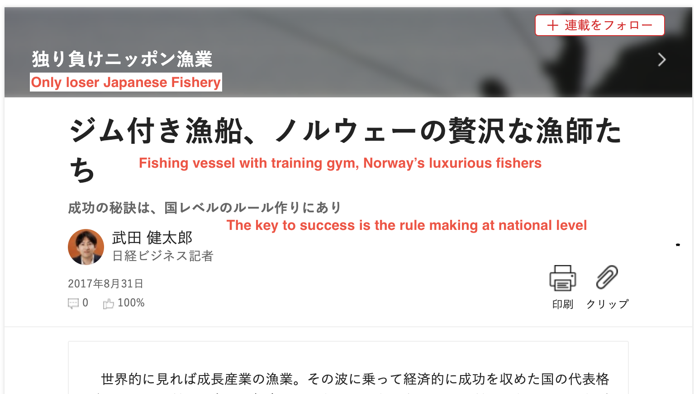
```
---

# How Japan sees Norwegian Fisheries?

```{r, echo = FALSE,out.width='100%'}
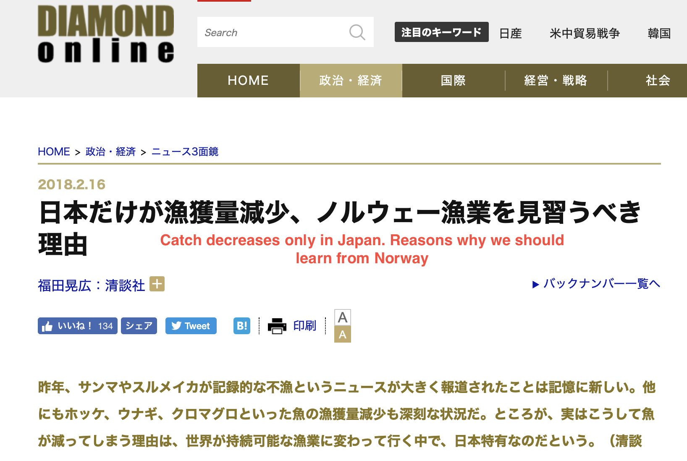
```

---
class: inverse, center, middle
name: fisheries

# The Fisheries

<html><div style='float:left'></div><hr color='#00BFFF' size=1px width=796px></html>
---

# Fisheries Catch 

```{r estat, include = FALSE}

appID <- "11217753824fd6ecf1d5cc2880b613e3ee724fdb"
## estat_getStatsList(appId = appID, searchWord = "海面漁業生産統計調査")

# data: 1979-2002
dat.annual1 = estat_getStatsData(
  appId = appID, 
  statsDataId = "0003229517"
)

# data from 2003-2012
dat.annual2= estat_getStatsData(
  appId = appID, 
  statsDataId = "0003229518"
)

# combine annual data.
dat.annual = bind_rows(dat.annual1,dat.annual2)

# data by species 0003238631
dat.species= estat_getStatsData(
  appId = appID, 
  statsDataId = "0003238631"
)


```


```{r, echo = FALSE,out.width='100%'}
knitr::include_graphics("catch.JPG")
```

???

catch and value?

fishers and fisheries has been declining.
It is mainly because technological progress.


---

# Nature conditions 

```{r natural, include = FALSE}

 if(FALSE){
   # OECD dummy and location of the capital data (compiled by hand)
   dat.oecd = read_csv("./data/oecd.csv") %>%
     mutate(capital_lat_NS = str_extract(Capital_lat,".$"),
                  capital_lon_EW = str_extract(capital_lon,".$"),
                  capital_lat = as.numeric(str_replace(Capital_lat,capital_lat_NS,"")),
                  capital_lon = as.numeric(str_replace(capital_lon,capital_lon_EW,""))) %>%
     mutate(OECD = ifelse(is.na(OECD),0,OECD)) %>%
     dplyr::select(Country,OECD,capital,capital_lat,capital_lat_NS,
                   capital_lon,capital_lon_EW)
   
   write_csv(dat.oecd, "./data/oecd2_capital_location.csv")
 }

dat.oecd = read_csv("./data/oecd2_capital_location.csv")

# Data is obtained from FishStatJ
dat.fao_catch = read_csv("./data/FishStat_world_catch_2010_2017.csv") %>%
           tidyr::gather(key = "year",value = "catch",-c(1:4)) %>%
           mutate(catch = ifelse(catch == "...",NA,
                                 ifelse(catch == "-",0,catch))) %>%
           mutate(catch = str_replace_all(catch," ",""),
                  catch = str_replace_all(catch,"F","")) %>%
           filter(`Unit (Unit)` != "Number") %>% # most of species with number is marine mammal (seal, whale, etc) 
           mutate_at(vars(year,catch),list(~ as.numeric(.)))
           # calculate the diversity measure (Shannon)

# make dataframe for lat x diversity by country (2010-2017 average)
dat.fao1 = dat.fao_catch %>%
           group_by(`Country (Country)`,`Species (ASFIS species)`) %>%
             summarise(catch = mean(catch,na.rm = TRUE)) %>%
           ungroup() %>%
           group_by(`Country (Country)`) %>%
             mutate(share = catch/sum(catch,na.rm = TRUE)) %>%
           ungroup() %>%
           mutate(log_share = ifelse(share == 0,0,log(share))) %>%
           filter(!is.nan(catch)) %>%
           mutate(share_log_share = share*log_share) %>%
           group_by(`Country (Country)`) %>%
             summarise(shannon = -1*sum(share_log_share,na.rm = TRUE)) %>%
           ungroup() %>%
           # merge OECD and capital location data
           left_join(dat.oecd,by = c("Country (Country)" = "Country")) %>%
           # only OECD countries
           filter(OECD == 1) %>%
           # remove shannon = 0 
           filter(shannon != 0)

```

```{r natural_plot, echo = FALSE}
# Plot lat x diversity (2010-2017 average)
ggplot(dat.fao1,aes(x = shannon,y = capital_lat)) + 
  geom_point(size = 2) +
  geom_smooth(method = "lm", se = FALSE) + 
  geom_text(aes(label=`Country (Country)`),hjust=-0.1, vjust=0, size = 5) + 
  gghighlight(`Country (Country)` == "Norway" | `Country (Country)` == "Japan") +
theme_bw() + 
  labs(x = "Diversity Index of Fisheries Catch, 2010-2017 Mean",
       y = "Latitude of capital city")

```

---

# Nature condition

```{r, echo = FALSE,out.width='120%'}
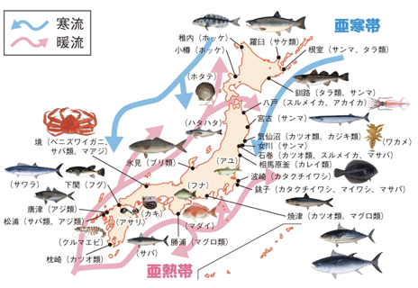
```
    


---

# Social conditions


```{r socialcondition,include = FALSE}
# total catch
dat.fao_catch_rank = dat.fao_catch %>%
                     group_by(`Country (Country)`,year) %>%
                       summarise(catch = sum(catch,na.rm = TRUE)) %>%
                     ungroup() %>%
                     filter(year == 2013) %>%
                     mutate(catch_rank = min_rank(desc(catch)),
                            rank40_d = ifelse(catch_rank <= 40,1,0))

dat.oecd2 = dat.oecd %>%
           left_join(dat.fao_catch_rank,by = c("Country" = "Country (Country)"))

# data for protein source dependency 
dat.fao2 = read_csv("./data/FAOSTAT_food_balanc_sheet.csv") %>%
           dplyr::select(-`Item Code`) %>%
           tidyr::spread(key = "Item",value = "Value") %>%
           left_join(dat.oecd2 %>% dplyr::select(Country,OECD,capital_lat, rank40_d), by = "Country") %>%
           # top 40 catching country + OECD
           filter(OECD == 1 | rank40_d == 1) %>%
           mutate(fish_rate = `Fish, Seafood`/`Animal Products`*100)

```

```{r social2, echo = FALSE}

# Plot lat x diversity (2010-2017 average)
ggplot(dat.fao2 %>% filter(Year == 2013), 
       aes(x = fish_rate,y = capital_lat)) + 
  geom_point(size = 2) +
  geom_smooth(method = "lm", se = FALSE) + 
  geom_text(aes(label=Country),hjust=-0.1, vjust=0, size = 5) + 
  gghighlight(Country == "Norway" | Country == "Japan") +
theme_bw() + 
  labs(x = "Percentage of Seafood in animal protein source",
       y = "Latitude of capital city",
       title = "Latitude and Seafood as protein source (2013)",
       subtitle = "Source: FAO Food Balance Sheet (2017)")

```
---

# Diversified target species

```{r diversified, include = FALSE}
  dat.fao_catch2 = dat.fao_catch %>%
                   rename(Country = `Country (Country)`,
                          Species = `Species (ASFIS species)`) %>%
                   filter(Country == "Norway" | Country == "Japan") %>%
                   # aggregate by species, not catch area
                   group_by(Country,year,Species) %>%
                     summarise(catch = sum(catch,na.rm = TRUE)) %>%
                   ungroup() %>%
                   arrange(Country,year,desc(catch),Species) %>% 
                   group_by(Country,year) %>%
                     mutate(catch_share = catch/sum(catch,na.rm = TRUE),
                            catch_share = ifelse(Species == "Marine fishes nei",0,catch_share)) %>%
                     arrange(Country,year,desc(catch_share),Species) %>%
                     mutate(rank = min_rank(desc(catch)),
                            cum_catch_share = cumsum(catch_share)) %>%
                   ungroup()
```


```{r diversified_plot,echo = FALSE}
ggplot(dat.fao_catch2 %>% filter(year == 2017 & cum_catch_share < 0.9), aes(x=Country, y=catch_share, fill=reorder(Species,catch_share),label = reorder(Species,catch_share))) + 
    geom_bar(stat="identity", width = 0.7) + 
    geom_text(position=position_stack(vjust=0.5)) + 
    labs(x = "Country",
         title = "Composition of top 90% of fish catch, 2017",
         subtitle = "Source: FAO FishStatJ,2019") + 
    scale_x_discrete(breaks = c("Japan","Norway"),
                     labels = c("Japan, 38 species","Norway, 9 species")) +
    theme_bw() + 
    theme(legend.position = "none")
    

## View(dat.fao_catch2 %>% filter(year == 2017 & cum_catch_share < 0.9))

```

---

# Number of Fishing Vessels and Fishers

```{r fleet, include = FALSE}

# https://stats.oecd.org/Index.aspx?DataSetCode=FISH_FLEET

# Number of vessels: data from OECD
dat.fleet1 = read_csv("./data/FISH_FLEET_18062019192141466.csv") %>%
            dplyr::select(Country,Fleet,Year,Unit,Value)

dat.fleet2 = dat.fleet1 %>%
            filter(Fleet == "Total vessels") %>%
            tidyr::spread(key = "Unit",value = "Value") %>%
            filter(Country != "OECD - Total")

# Number of fishers: data from OECD
dat.fisher = read_csv("./data/FISH_EMPL_18062019192512020.csv") %>%
             dplyr::select(Country,`Economic sector`,Gender,`Occupation rate`,Year,Unit,Value) %>%
             filter(Gender == "Total by Gender" & `Occupation rate` == "Total by Occupation rate") %>%
             tidyr::spread(key = "Economic sector",value = "Value") %>%
             mutate(`Inland Waters Fishing` = ifelse(is.na(`Inland Waters Fishing`),0,`Inland Waters Fishing`),
                    marine_fishing = `Fishing Sector` - `Inland Waters Fishing`) %>%
             filter(Country != "OECD - Total")

# merge two data
dat.fisher_fleet = dat.fleet2 %>%
                   left_join(dat.fisher %>% dplyr::select(Country,Year,marine_fishing), by = c("Country","Year"))


```

```{r fleet_plot,echo = FALSE}


# Plot vessel x fisher (2017)
ggplot(dat.fisher_fleet %>% filter(Year == 2013 & Country != "Indonesia"),aes(x = marine_fishing,y = Number)) + 
  geom_point(size = 2) +
  # geom_smooth(method = "lm", se = FALSE) + 
  geom_text(aes(label=Country),hjust=-0.1, vjust=0, size = 5) + 
  gghighlight(Country == "Norway" | Country == "Japan") +
theme_bw() + 
  scale_y_continuous(labels = function(x) format(x, scientific = FALSE)) +
  labs(x = "Number of Occupation fishers (excl. Inland Fishing)",
       y = "Number of Fishing Vessels",
       title = "Fishers and Vessels, OECD Countries (2013)",
       subtitle = "Source: OECD.Stat (2018)")


```

???

Fisher-vessel ratio? fishers per vessel
Nor: 11611/6126 = 1.89
JP: 180990/262742 = 0.688


---

```{r fleet_compo, include = FALSE}

# For Japanese data, fleet, fishery census 2013

dat.fleet.jp = estat_getStatsData(
  appId = appID, 
  statsDataId = "0003116334"
) %>%
  filter(`漁船・動力漁船トン数規模`!= "計") %>%
  filter(`漁船・動力漁船トン数規模` !="動力漁船") %>%
  group_by(`漁船・動力漁船トン数規模`) %>%
     summarise(value = sum(value,na.rm = TRUE)) %>%
  ungroup() %>%
  bind_cols(category = c(3000,3,20,150,200,1,30,350,5000,5,50,500,10,100,1000,6000,7000)) %>%
  arrange(category)

# Fleet Norway

dat.fleet.nor = dat.fleet1 %>% 
  filter(Country == "Norway" & Year == 2013 & Unit == "Number") %>%
  filter(Fleet != "Total vessels" & Fleet != "Vessels with engine") %>%
  bind_cols(Fleet2 = c(0,6,12,18,24,30,36,45,60,75))


```

# Fleet composition：Norway

```{r, echo = FALSE}
ggplot(dat.fleet.nor,aes(x = reorder(Fleet,Fleet2), y = Value)) + 
  geom_bar(stat = "identity") + 
  labs(x = "Vessel Length Category",
       y = "Number of Vessels") + 
  theme_bw() + 
  theme(axis.text.x = element_text(angle = 45,hjust = 1))

```
---

# Fleet Composition: Japan

```{r, echo = FALSE}
ggplot(dat.fleet.jp,aes(x = reorder(`漁船・動力漁船トン数規模`,category), y = value)) + 
  geom_bar(stat = "identity") + 
  labs(x = "Vessel Tonnage Category",
       y = "Number of Vessels") + 
  theme_bw(base_family = "HiraKakuPro-W3") + 
  theme(axis.text.x = element_text(angle = 45,hjust = 1)) 
```


???

The distribution looks similar?
But many of the fishing vessels are with outboard motors. 
These vessels usually 5m-10m length, less than 5 ton. 

indicates many small scale fishers

---

# How to characterize Japanese fisheries?

* Natural condition:
    + Islands extend to North-South, from subarctic to tropical area
    + -> High Biodiversity -> Target fish species are also diversified. 

* High dependency on seafood as protein source
    + As a result of food culture and geographic condition
    + Norway too, but Japan's dependency is higher.
    
* Many vessels, many fishers
    + -> Many small scale fishers


---
class: inverse, center, middle
name: category

# Key categolization

<html><div style='float:left'></div><hr color='#00BFFF' size=1px width=796px></html>

---

# Main categolization

* Coastal Fisheries

* Offshore Fisheries

* Distant Water (High Seas) Fisheries

* (Inland Water Fisheries)

---

# Coastal Fisheries

* 1-2 days per operation along the coast
* Managed by local organizations of fishers, mainly Fisheries Cooperative Associations (FCAs)
* The business are mostly run by family members
* Rights-based fisheries 


```{r, echo = FALSE,out.width='60%'}
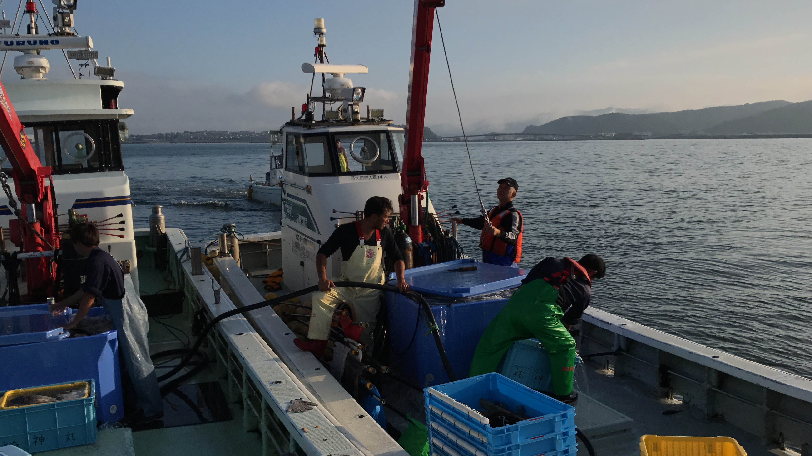
```

???

Defined by fishing method (gyo-hou). until 2010, the definition was based on the size of vessel (< 10GT). 

---

# Offshore Fisheries

* Industrialized fisheries that operate within Japanese Economic Exclusive Zones (EEZ)
* The normal size of vessels is up to 100 GT
* Moves across prefectural borders


```{r, echo = FALSE,out.width='80%'}
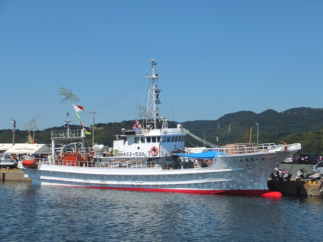
```
    

---

# Distant Water Fisheries (High Seas)

* Highly industrialized
* Operating in high seas and the EEZs of other countries
* Has been declining since the EEZs are introduced. 

```{r, echo = FALSE,out.width='80%'}
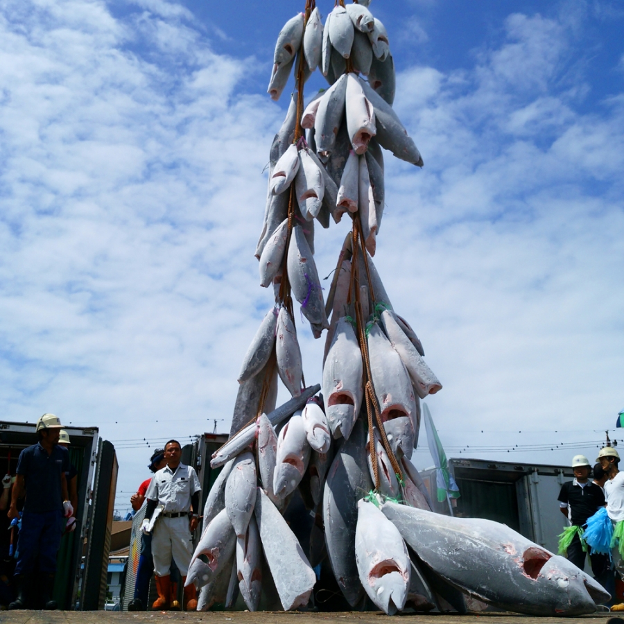
```


---
class: inverse, center, middle
name: history

# Brief History

<html><div style='float:left'></div><hr color='#00BFFF' size=1px width=796px></html>

---

# Very brief Japanese Hisotry

* Before 1192: The Aristocratic regime (Heian)
--

* 1192-1602: Samurai (Warrior class) Dynasties
    + Unstable and conflicts
    + Some dynasties followed by Warring States period
--

* 1603-1868: Edo Era by Tokugawa Dynasty. 
    + A stable feudal era 
--

* 1868: Meiji Era, Modernization period
    + Industrialization under the restoration of imperial rule 
--

* 1945: After World War 2
    + Dramatic institutional change
    
---

# Up to the Edo Era

* People on the Japanese Archipelago was fishing and shellfish-gathering at latest by 10,000BC-300BC
* Taiho code in 701AD: First legal provision about fisheries
    + Resources in the mountains, rivers, and coastal areas were open to all
    + Not subject to taxation
    + Contrast to agricultural land...
--
* After Heian Era, Samurai dynasties strengthen the rights of feudal landlords.
    + But the fisheries management still followed the Taiho code.


???
(Makino 2011, pp22)
* more than 2500 Shell mounds found along the Japanese coast. 
* First legal provision relating to fisheries is found in the compilation of Taiho Code from 701AD 
* scrubland: low tree area
* bog: mud-carbon area 
* For Agricultural land, specific users were identified and levies were imposed by the central government. 

---

# Edo Era, A stable feudal era

* Stable political system
* Each village as a formal administrative unit
    + The head of each village acted as a government official
    + In charge of collecting rice-based taxes, and applied levies

--

* Increased population => Demand for seafood
    + Development of coastal fisheries
    + Conflicts among villages over fishing ground

--

* => *A new set of regultions in 1743*
    + Coastal fishing grounds: Only by the local fishing communities
    + Offshore fishing grounds: Open for free access by any fishers


???

* Feudalism: Social system. Daimyos, feudal lord, held lands from the Shogun in exchange for military service, and vassals were in turn tenants of the nobles, while the peasants (villeins or serfs) were obliged to live on their lord's land and give him homage, labour, and a share of the produce, notionally in exchange for military protection.

* Levies: such as forced-labor

* Coastal fishing ground were regarded as extension of the land and thus a part of the feudal domain. The feudal lords partitioned the coastal waters and allocated them to local communities under the control of the village heads.

---

# Edo Era, A stable feudal era

* In the middle of the Edo Era, technological progress and population increase enabled the development of capitalized, labor-intensive fisheries. 

```{r, echo = FALSE,out.width='60%'}
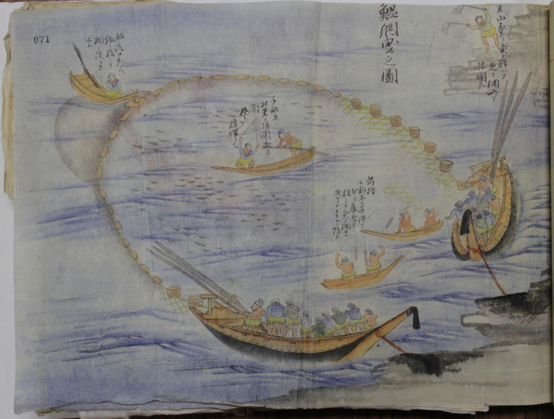
```

???

http://snn.hatenablog.com/entry/2013/07/07/001756

* The guy on the top of the rock give signal when the sardines come into the bay

* Two vessels connected the net surround the fish school

* Pull them to the shore, then ties the Edge of the net to wheel on the shore to pull out the net. Young boys who cannot get on the board help rotating wheels. 

---

# Edo Era, A stable feudal era

* Upper fishers who owns such fishing gears dominates the local fishing operations
    + Local guilds are organized to operate fisheries
    + Groups by area, and fishing types, including offshore fisheries
    + Established rules about seasons, methods, fishing grounds
    + The regimes were protected by feudal lords in exchange for contributions
    + Worked as formal institutions

---

# Digression: History of Sushi

* Originates in a Southeast Asian dish
    + Stored food. Fermented rice prevents the fish from spoiling. 
    + Known as _Narezushi_ in Japan around 750 A.C.
--
* _Edomae_ Sushi 
    + In late Edo Era (1800's), some food stands started current style sushi
    + Used fresh fish in Edo Bay, _Edomae_ means "in front of (_mae_)" Edo. So, only available in Edo (Tokyo)
--
* Spread nationwide
    + In Meiji Era, the development of ice making technology and fridge enabled more fresh sushi
    + After Earthquake in East Japan (1923), Tokyo was devastated, and many sushi chefs left Tokyo and current style of sushi spread out Japan.  

```{r, echo = FALSE,out.width='40%',fig.align='right'}
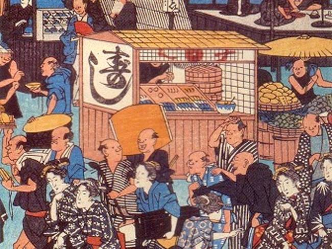
```
    
---

# Meiji Revolution and Fisheries Law

* The new government carried out a radical modernization of the national institutional framework
* For fisheries management, it nationalized Japan's seas and introduced centralized license system to access seas
    + Top-down management via limited entry (license with fee)

--

* Many people, who were NOT fishers, applied for licenses
    + Fisheries landing tripled in 7 years after the change
        + Edo fisheries management worked well to control the fishing pressure
    + Many new entrances imply that there were positive profit/rent in the fisheries under Edo Era scheme

--

* The rise in landing was temporary, and the catch dropped soon
    + Many fishers, low catch -> conflicts
    + Fisherman's Union Regulation in 1886
        + Original form of FCAs
    + Back to local management, with formal recognition
    
* Meiji Fisheries Law in 1901
    + Fishing rights and licenses into statutory form
    + Rights limited to fishing methods and species
    + Transferring fishing rights were allowed
    


---

# Fisheries Reform after WWII

* Japan under the U.S. army of occupation in 1945
    + No vessel operations including fishing are allowed
    + Many fishing vessels were confiscated and sank

* Fisheries Law (i.e. "current" law) is enacted in 1949
--

* Between socialism and capitalism
    + First plan: All fishery rights were to be granted only to fishing people's organization. Vested individual rights holder opposed. 
    + End up somewhere medium: The organizations have priority. 

* Main purpose: strengthen the production power of fisheries to satisfy domestic food demand
    + Not much care about sustainability, but supporting expanding production power. 


---

# Summary of History

* The principle of Japanese fisheries management
    + Resource users (fishers) are the resource managers
    + The principle has been developed through the community-based use of common resources, stems from the Taiho code
    + Institutions has been developed in Edo Era
    + Radical change to top-down management failed

---
class: inverse, center, middle
name: management

# Japanese Fisheries Management

<html><div style='float:left'></div><hr color='#00BFFF' size=1px width=796px></html>

---

# Objectives

* The fundamental law, Fisheries Act, was enacted in 1949
* The Article 1 of Fisheries Law states..
    + Establish basic system (institution)
    + Promote systematic utilize of water by fisheries adjustment organization
    + Enhance fisheries productivity
    + Democratize the fishing industry
    
--

* Systematic utilize? (holistic utilization)
    + Three dimensional, multiple utilization of water
    + Interaction among fisheries
    + -> Subdivided fishing area is not appropriate
    + Rights and Licenses with limited species, methods, and grounds
        + Operating diverse fisheries in a marine area
    + Coordination of operations within a certain area from a overall point of view


???

Diversified target species, fishing method 

---

# Fishing Rights and Licenses

* Fishing rights: Rights to conduct fishery operation exclusively in specified area by specified method
    + They do not allow to privatize the sea surface
    + Cannot be sold, leased, and transferred
    + Mainly for coastal fisheries
    
--

* Fishing licenses: Some fisheries are generally prohibited, licenses lift the prohibition in a specific case.
    + Mainly for offshore and distant water fisheries
    + Prefectural governor-licensed and Minister-licensed

---

# Fisheries Coordination

* "Fisheries adjustment organization" or coordinating organization

--

* Nested system
    + From national, prefectural to local level organizations 
    + Various co-ordinations are made
        - Evaluate the eligibility of rights holders
        - Advice governors to establish fishing area plan (how to set rights)
        - Make limitations and prohibitions of operations if necessary
--

* Local level: FCAs and Fisheries Management Organizations
    + FCAs are main subjects to hold fishing rights
    + Also the local level coordinating organization among fishers
    + FMO is an autonomous and specialized group within FCAs.
        - Make rules for FCAs, or even stricter self-regulations

---
class: inverse, center, middle
name: cases

# Resource Management

<html><div style='float:left'></div><hr color='#00BFFF' size=1px width=796px></html>

---
# Resource Management-type Fisheries

* Resource management-type fisheries (_Shigen Kanri Gata Gyogyo_)
    + Local fishers, within FMOs or FCAs, implement resource management for themselves
    + e.g. self-regulated no-take seasons/areas, limiting methods & gears
    + Based on scientific knowledge supplied by local fisheries experiment stations
    + Known as a form of **co-management**
--

* Advantages
    + Flexibility based on local knowledge and information
    + High compliance rate 
    + Low enforcement cost
--

* Weakness
    + Difficulty of coordination in wide-range/cross-jurisdictional issues and between fisheries
    + Need every member's consensus -> drastic changes tend to be avoided
    + Evidence of sustainability is weak. Main aim is to increase income.

 
---

# Resource Recovery Plan

* Resource Recovery Plan (RRP) system
    + Strengthen the approach of Resource Management-type Fisheries
    + with official support from the government
--
* New Measures
    + Established new coordinating committee: Wide-Area Fisheries Coordinating Committees (WFCCs)
    + Economic Support System compensates a part of the economic loss caused by drastic measures
    + Total Allowable Effort (TAE): Set total operation days for fishery


???

WFCCs coordinate the fisheries that aims wide-distributing or migratory species. 

ESS: To recover stock, innovative, drastic measures are required. e.g.  includes fishing ban. It may take several years. The local community economic conditions are worsened if the resource become depleted. They may not be able to adopt drastic measure even if they wish. 

TAE: under the Law Regarding the Preservation and Management of Living Marine Resources.  Even some people decrease the fishing effort (e.g. suspend operations, cut their number of vessels), other fishers increases, then the management fail. To prevent, TAE is determined. 

TAE is set for the entire fishery, so even if one FCAs or prefecture implement the management, other prefectures cannot get advantage by increasing it. 

--- 

# Japasense TAC

* Introduced Total Allowable Catch (TAC) for (only) 8 species.
* TAC
    + Directly manages the catch of specified species with the upper limit of total catch
    + Scientists (the Fisheries Research Agency) make recommendation on the total catch (called Allowable Biological Catch, ABC)
    + The management body determines the level of TAC based on the ABC
    + Normally, ABC > TAC
  
* Japanese TAC?
    + TACs are determined through the discussion with representatives of fisheries organizations, then evaluated in the Fishery Policy Council, and then the Minister of Agriculture, Forestry and Fisheries decides the final TACs. 
    + TACs are allocated to Minister- and Governor-managed fisheries, then area and fisheries. 
    + This enables local FCAs and organizations to implement own rules.
    
        
    
???

8 species: Pacific saury (Samma), Walleye Pollock, Japanese jack mackerel (aji), Japanese sardine, Chub mackerel, spotted chub mackerel, Japanese common squit (Surumeika), Snow crab (Zuwai gani)

---

# Allocation of TAC: Walleye Pollock

```{r, echo = FALSE,out.width='90%'}
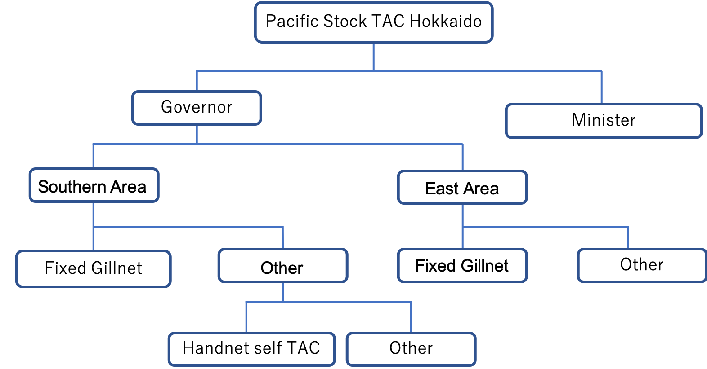
```

???

Flexibility of rules depending on local conditions

Examples of local rule: Limit daily catch per vessel (Kushiro), Individual quota (Hiroo), Pooling revenue (Muroran, Hidaka)
---

# Actual TAC and ABC

```{r, echo = FALSE,out.width='90%'}
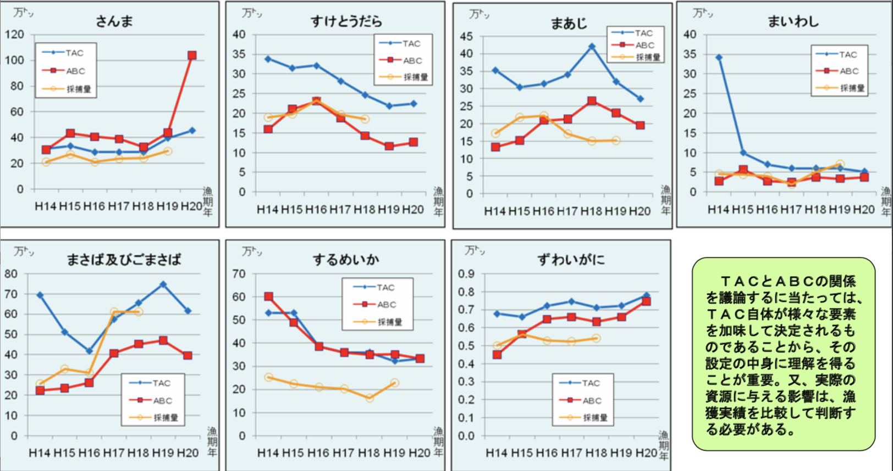
```

---

# Policy reform in 2018

* In December 2018, Fisheries Act was amended for the first time since 1949

* Main points
    + Deleted "by fisheries adjustment organization"
    + Sustainable utilization
    + MSY-based management
    + Individual Quota
    + Defined the responsibility of prefectural governments as managers 
    
* Shift from co-management to top-down?
    + But still current management scheme for coastal fisheries are kept
    + No details are determined yet..
    

???

http://www.sangiin.go.jp/japanese/joho1/kousei/gian/197/pdf/s0801970081970.pdf

From the Article 1, "by fisheries adjustment organization" is not mentioned anymore. 

+ It adds "make sure of sustainable utilization"

+ To keep and realize MSY level stock. (Article 12)


---
class: inverse, center, middle
name: cases

# Case Studies

<html><div style='float:left'></div><hr color='#00BFFF' size=1px width=796px></html>


---

# Glass Shrimp Fishery

.pull-left[
* Glass Shrimp in Toyama, a.k.a. "Jewel of Toyama Bay"
    + Uniquely caught only in Toyama
* In 1985, large reduction of catch occured
    + It took more than 10 years to recover

* Started autonomous resource management in 2003
    + Data Collection: CPUE and individual size
    + Self-regulation: Coordinated fishing halt and no-take period
    
]


.pull-right[

```{r, echo = FALSE, out.width='90%'}
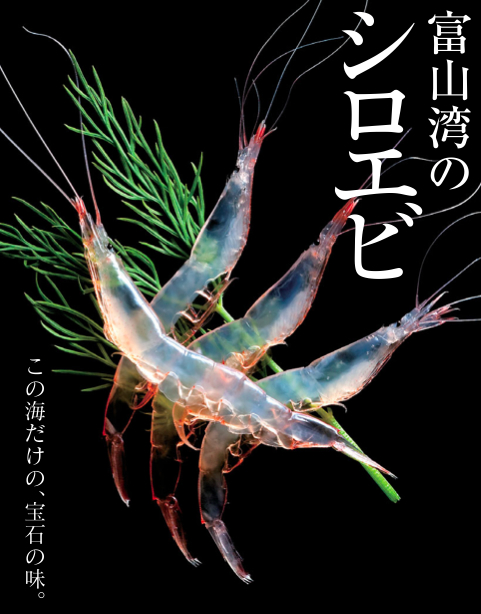
```

]


???

Determined the base year of the resource status with CPUE and size, then set the criteria to stop operations.


```{r, echo = FALSE}
knitr::include_graphics("shiroebi.png")
```


---
class: inverse, center, middle
name: comparison

# Comparison of frameworks

<html><div style='float:left'></div><hr color='#00BFFF' size=1px width=796px></html>

---

# Summary of Japanese Fisheries

* Many small-scale community-based fisheries
    + Co-management is the main form of resource management
    + Government role has been coordination among communities
* Diversified targets and types of fisheries 
    + Based on natural conditions and development over long hisotry

* Outcome?
    + Fisheries has supported employment and income in coastal areas

* Resource management?
    + Locally successful, but the outcome differ community by community
    + Not very successful for large-scale, wide-range, industrialized fisheries


---

# Difference?

* Top-down management v.s. Co-management? 

* Dualism v.s. Monolism?
    + Who is responsible for resource management?

--
* Combination? 
    + Japan seems to shift to top-down type
    + Norway balances out the two? 

???

Dualism?
In the US, "Public Trust Doctrine" is the main form.
Government is responsible for the management as citizen trust it to the government.
In Japan, holistic management by fishers themselves. 


---
class: inverse, center, middle
name: itq

# ITQs for Japanese Fisheries

<html><div style='float:left'></div><hr color='#00BFFF' size=1px width=796px></html>

---

# ITQs for Japanese Fisheries

* ITQs are good?
    + If ITQs were implemented in 1970, the current collapsed stock would have been less than 10% (Costello et al. 2008)

* Effective species are only those that are easy to introduce
    + Low biodiversity, high biomass

* Makino (2010) argues the conditions for ITQs
    + High value, single or few species fisheries
    + Fishers are identifiable
    + Participating vessels are not too many
    + Fishers are organized
    
* ITQs may complicate the rules of management
    + The number of regulations rather increased in Norway, New Zealand, and Australia (Hersoug, 2005)

??? 

Makino 2013, pp146


---

# Thank you!

```{r, echo = FALSE,out.width='90%'}
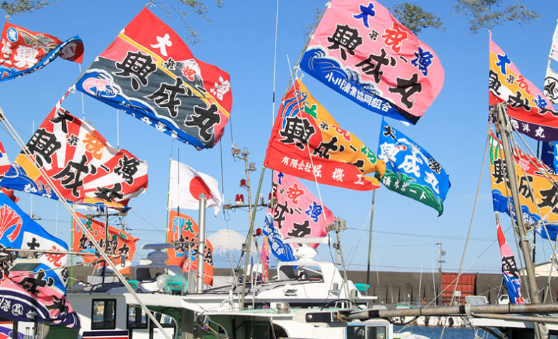
```

---

